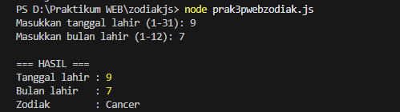
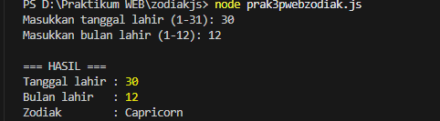
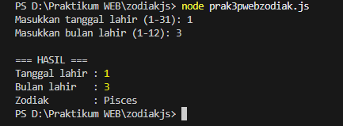

# Program Penentu Zodiak (Node.js CLI)

Program ini dibuat menggunakan JavaScript (Node.js) dan dijalankan melalui terminal.  
Fungsinya untuk menentukan zodiak berdasarkan tanggal dan bulan lahir yang dimasukkan oleh pengguna.

## Cara Menjalankan Program

1. Pastikan Node.js sudah terpasang di komputer
2. Buka terminal pada folder project
3. Jalankan perintah:
   ```bash
   node zodiak.js
   ```
4. Masukkan tanggal dan bulan lahir sesuai yang diminta program

## Penjelasan Kode

Program menggunakan modul bawaan Node.js yaitu `readline` untuk membaca input dari terminal.

```js
const readline = require("readline");
```

Bagian ini membuat koneksi antara program dan terminal supaya bisa menerima input dan menampilkan output.

```js
const rl = readline.createInterface({
  input: process.stdin,
  output: process.stdout
});
```

Fungsi `getZodiac` digunakan untuk menentukan zodiak berdasarkan tanggal dan bulan lahir.  
Setiap kondisi `if` mewakili rentang tanggal suatu zodiak.

```js
function getZodiac(day, month) {
  if ((month === 3 && day >= 21) || (month === 4 && day <= 19)) return "Aries";
  ...
}
```

Program kemudian meminta pengguna memasukkan tanggal dan bulan lahir melalui terminal.

```js
rl.question("Masukkan tanggal lahir (1-31): ", (dayInput) => {
  rl.question("Masukkan bulan lahir (1-12): ", (monthInput) => {
```

Input dari terminal berupa teks, sehingga diubah menjadi angka menggunakan `parseInt`.

```js
const day = parseInt(dayInput);
const month = parseInt(monthInput);
```

Selanjutnya program mengecek apakah input valid (angka dan dalam rentang yang benar).

```js
if (isNaN(day) || isNaN(month) || day < 1 || day > 31 || month < 1 || month > 12)
```

Jika valid, program memanggil fungsi penentu zodiak lalu menampilkan hasilnya di terminal.

```js
const zodiac = getZodiac(day, month);
console.log("Tanggal lahir :", day);
console.log("Zodiak        :", zodiac);
```

Terakhir, input terminal ditutup dengan `rl.close()`.

## Contoh Output

Percobaan 1
```
Masukkan tanggal lahir (1-31): 09
Masukkan bulan lahir (1-12): 7

Tanggal lahir : 09
Zodiak        : Cancer
```

Percobaan 2
```
Masukkan tanggal lahir (1-31): 30
Masukkan bulan lahir (1-12): 12

Tanggal lahir : 30
Zodiak        : Capricorn
```

Percobaan 3
```
Masukkan tanggal lahir (1-31): 1
Masukkan bulan lahir (1-12): 3

Tanggal lahir : 1
Zodiak        : Pisces
```

## Screenshot

  
  


## Kesimpulan

Program ini dapat menentukan zodiak berdasarkan tanggal dan bulan lahir yang dimasukkan pengguna melalui terminal menggunakan Node.js.  
Program juga melakukan pengecekan input sehingga hanya menerima tanggal dan bulan yang valid.
